# Title: Lineup - Final Report

## Overview:
Sports betting has become increasingly popular in the last few years. There are already many apps that allow you to bet on various sporting events and other sport-related cases on the app store. However, there are very few that allow you to share your bets and display them to the world as a social media platform. In addition, it also gets tiresome to constantly have to screenshot and share your bets with your friends when you all are constantly active with betting.

With these ideas in mind, we decided to create an app that would allow users the ability to share their bets and bettings history with ease to their friends and the world.

Lineup allows users the create bets to display on their profiles. Through the app, users can add various information to their bets such as event locations, how many were wagered, the betting odds, and other inputs. The bets are also geotagged to allow users to reminisce on where they were when they hit their high-earning bet or their pocket-emptying loss. Users can choose to add their friends as well as see their friend's betting histories as well. There are many other features such as liking bets, favoriting bets, private profiles, and more in the future.

## Goals:
### Minimum
**1. Users can create, save, and post their bets ✅**   
At a minimum, users should able be to simply fill out a form about their bet's information and have that bet saved to their profile. The information the bets store should, at minimum, include the bet's title, description, event location, amount wagered, betting odds, and event date. The goal serves as a bare minimum as the app is centered around creating and sharing bets.

**2. Account information, including bets, stored in a remote database ✅**   
Everything about a user and all their information should be stored in a remote database in order to persist throughout the existence of the app and their accounts. Items such as the user's name, email, betting history, etc. should all be stored in some database; in the end, we ended up using Firebase.

**3. Bets are geotagged using location services so that users can keep it as a memory of where they were when their bets were active ✅**   
When creating a bet, the bet should automatically use Location Services to track where the user currently is when they made their bet. The location will then be parsed into \<City\>, \<State\> and be displayed on their bets.

**4. View other user's accounts ✅**  
Users should be able to go on the app's explore page and click on other users to view their profiles.

**5. View other user’s bets ✅**  
When viewing other user's profiles, users should also be able to see all of the bets of other users as well.

**6. Option to make an account private ✅**  
While sharing bets with others is an integral part of the app's social functionality, users should also have the ability to private their profile and hide it from other users as well. There should be some button or setting that allows users to private their accounts.

### Stretch
**1. Friends list system ✅**  
At a minimum, the app will just allow users to browse through all users' profiles and bets. In the future, having the option on other users' profiles to add that user as a friend would be nice to have as well.

**2. A feed to see friends bets TODO**   
Once friends lists are rolled out, it would be nice to have the feed show only a user and their friend's bets as most users would probably not care about random people's bets at that point.

**3. Interact with another user’s bet (likes/comments) ✅**  
Adding onto the social functionality of the app, adding more interactive features such as liking or commenting on other users' bets would be a good way to add more engagement to the app.

**4. Password recovery system for forgotten passwords TODO**  
Forgetting passwords happens to all of us. Having the option to recover accounts with forgotten passwords would be a nice feature to have instead of getting permanently locked out of the account.

## User Interaction Walk-Throughs:
### Registering an Account and Logging In
**1. Choose a registering option**   
Users can pick between creating an account directly through the app with a username and email/password combination, or through Google by logging into their Gmail account through Google's login API and giving Lineup permission to access their basic information.

**2. Logging into an existing account**   
Users can, again, pick between logging in through the app directly, or through Google's login API with their Gmail accounts.

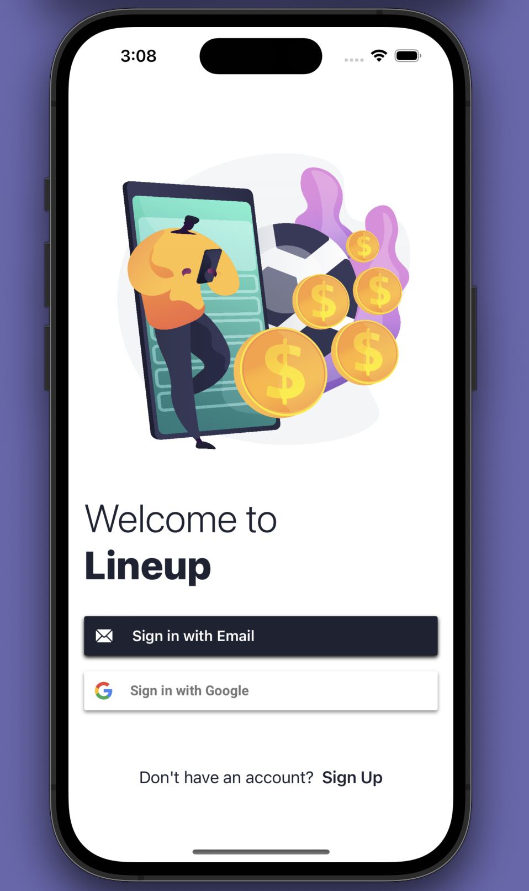

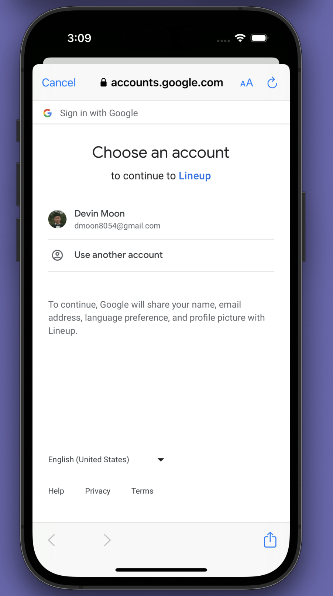

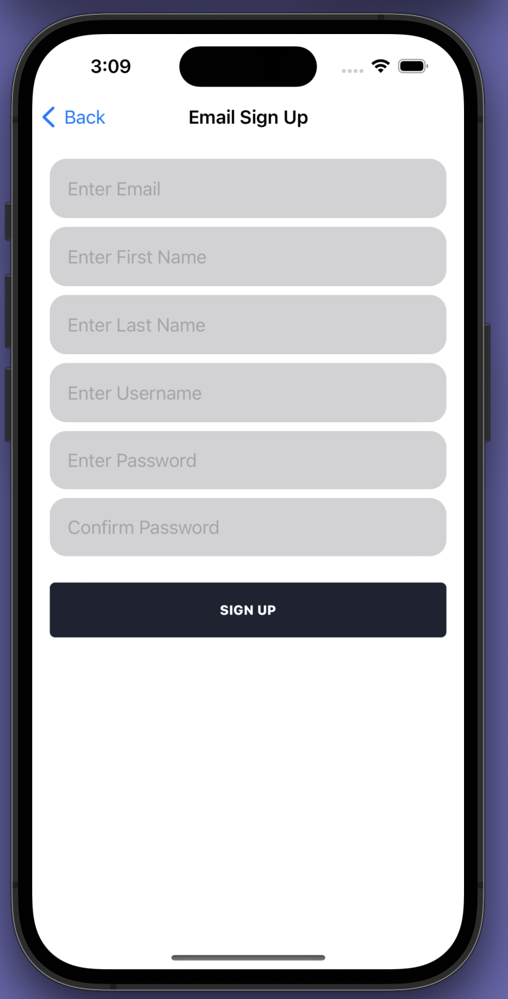

### Creating a Bet
**1. Click on Add Bet on the main page**  
In the top right corner of the main page, there is an Add Bet button. Clicking on it will bring the user to the Add Bet page.

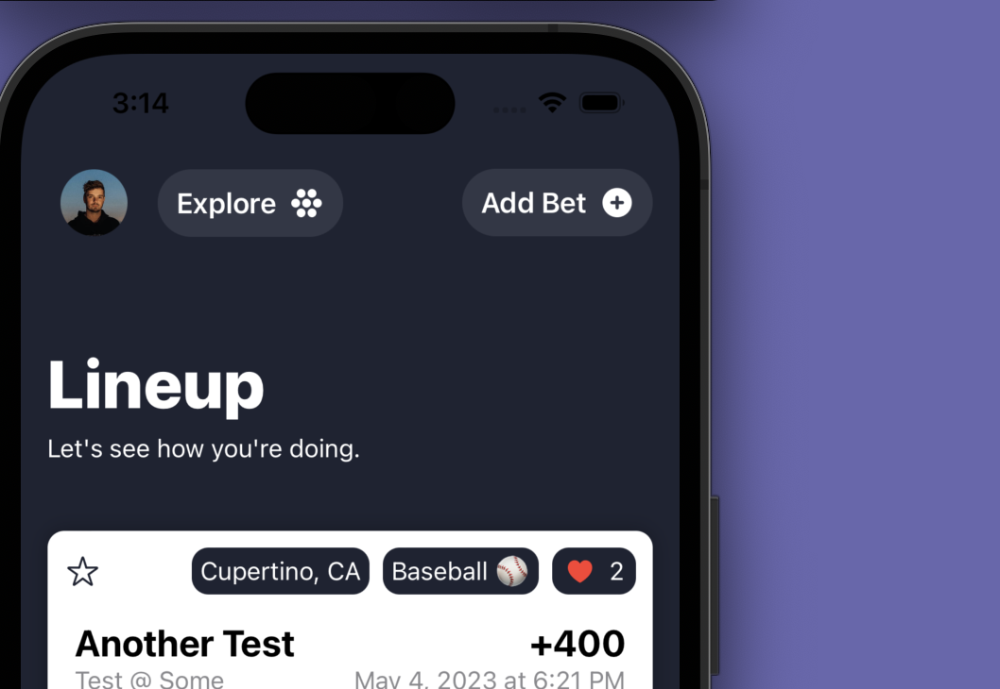

**2. Fill out the appropriate information**  
On the Add Bet page, there are many inputs the user needs to fill out for their bet. The user can go through and fill out all of the information until they are happy with the info they provided.

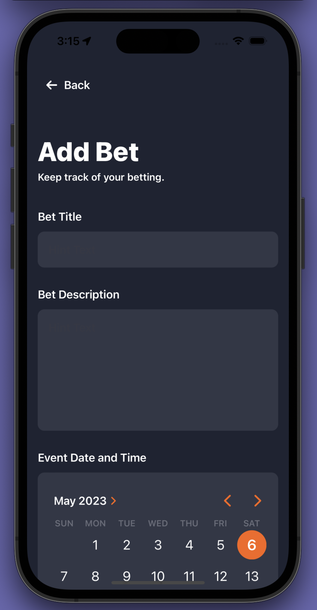

**3. Click on the Add button at the bottom**  
Towards the bottom right of the page, there is an Add button that validates and creates the user's new bet. If some of the information is missing, or wrong (e.g. the wager amount is a negative number or the betting odds are between -100 and 99), an alert will pop up telling the user to correct the mistakes. Otherwise, the user will be taken back to the home page where they can see their newly created bet pop-up.

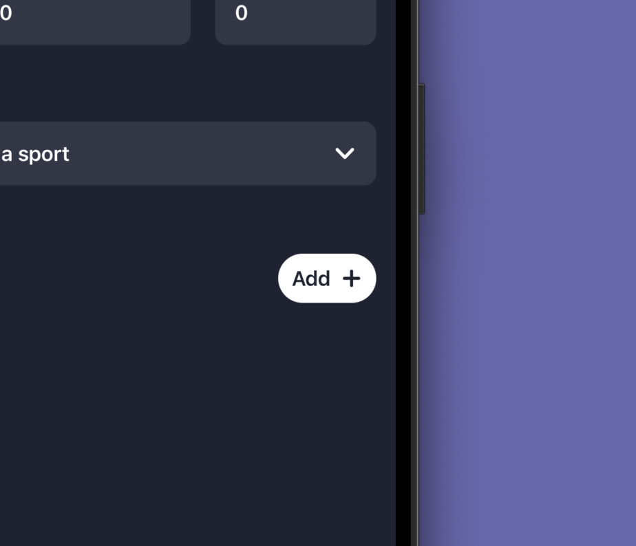

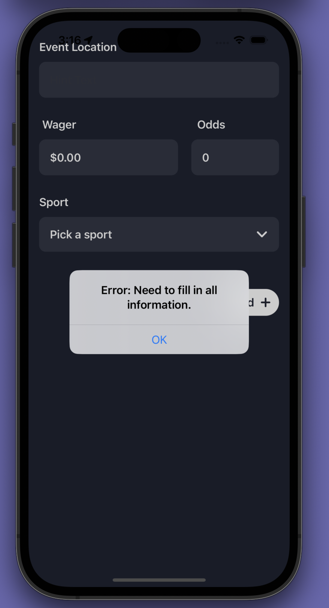

### Saving a Bet to Photos
**1. Tap on a bet on the main page**  
From the main page, the user can find a bet they want to save and then tap it to bring up a small menu at the bottom of the screen.

**2. Click on the save image icon**  
In the menu, the user can click on the save image icon and it will save the bet they selected into their photos app.

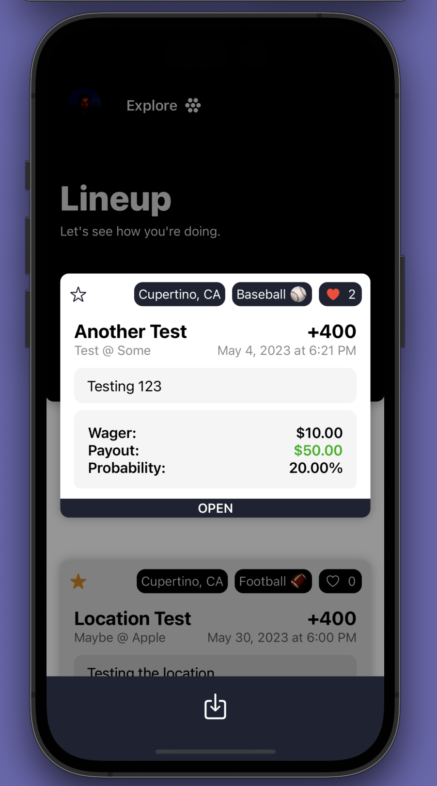

### View and Interact With Your Profile
**1. Tap on your profile picture on the main page**  
On the main page, the user's profile picture will appear in the top left of the screen. Tapping on it will bring the user to their profile.

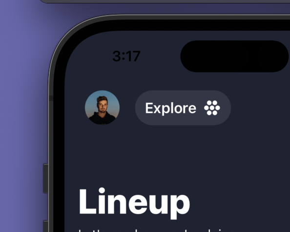

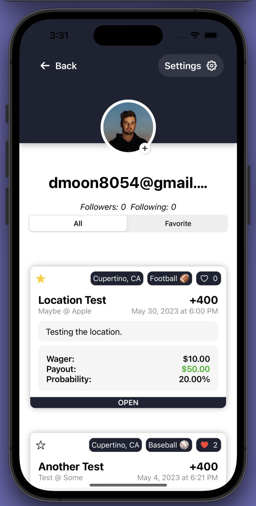

**2. To favorite a bet, tap on the star next to one of your bets**  
All of the bets a user has on their profile will have a star at the top right of each of their bets. Tapping on it will fill the star with yellow signifying it has been favored. To unfavorite a bet, simply tap on the star again.

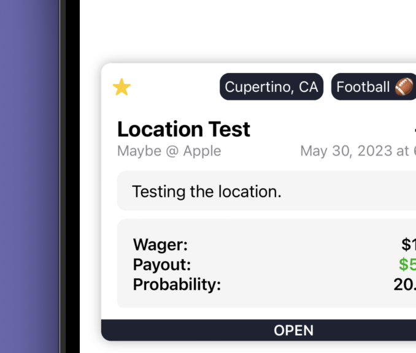

**3. View only favorite bets by clicking on the Favorite bets section on the picker**  
The user has the option of viewing either all of their bets or only their favorite bets by clicking on the option they want using the picker.

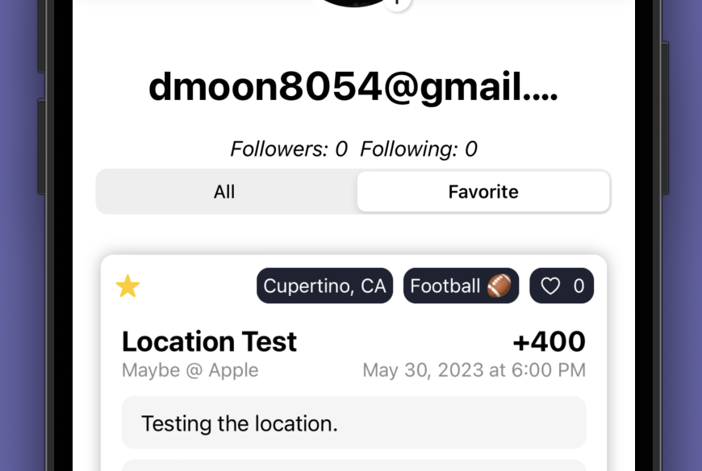

**4. There is also a settings page with various actions for the user to choose from.**  
Clicking on the settings button on the user's profile will bring up a page with many options. The user has the option to change their username, delete their account, change their profile's visibility, and also to log out of the app.

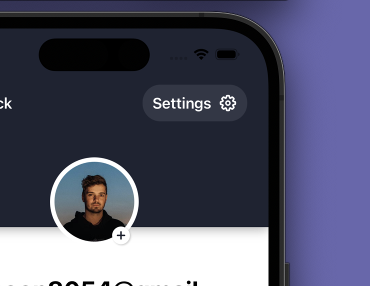

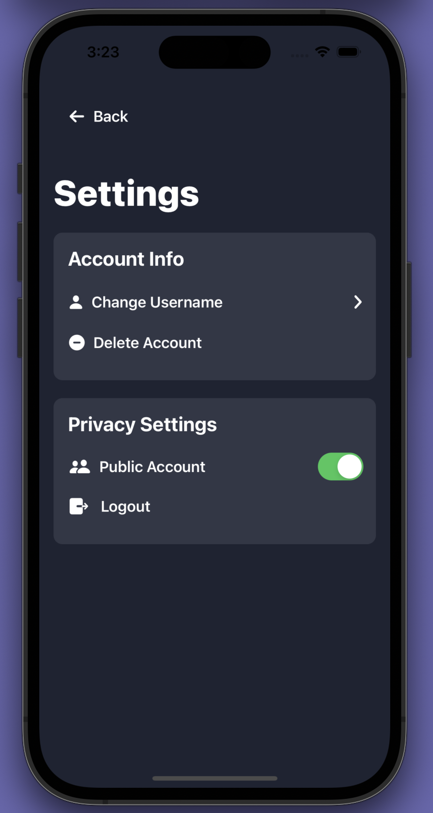

**5. To private your account, you can tap on the toggle button on the settings page.**  
Initially, user's accounts are set to public. However, the user can tap on the button to either private or make public their account.

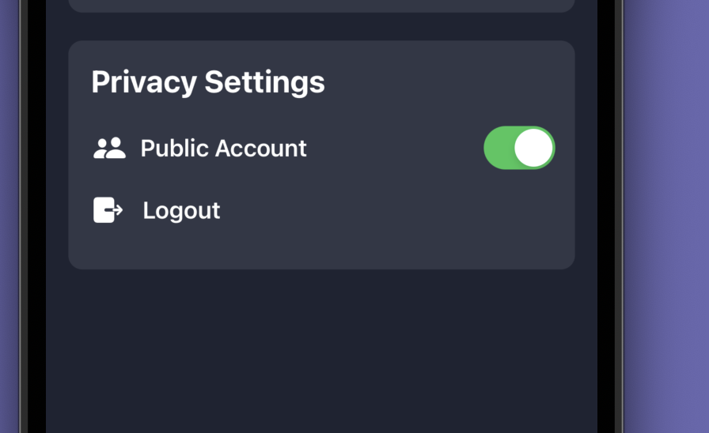

### View and Interact with Other User's Profiles
**1. Click on the Explore button**  
On the main page, there is an Explore button near the top right of the screen next to the user's profile picture. Clicking on it will bring the user to the Explore page.

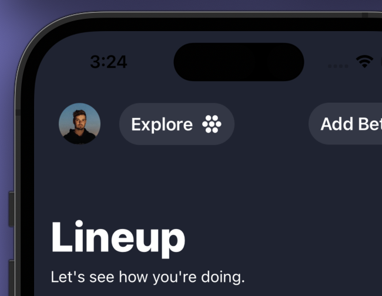

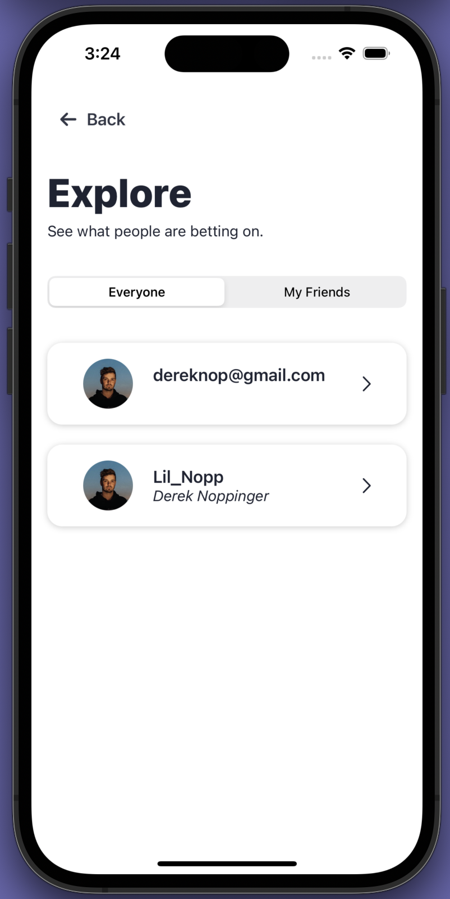

**2. Tap on a user that you want to view**  
On the Explore page, there are a bunch of cards with information about each user. Tapping on one will bring up the profile for that specific user.

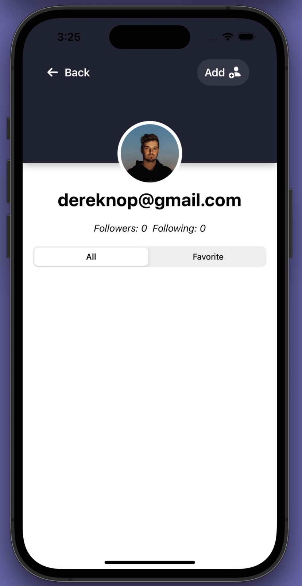

**3. To add a user as a friend, click on the add button at the top right of the page**   
Tapping on the Add button near the top right of the page will add that user as a friend. To unfriend, you can just tap the button again.

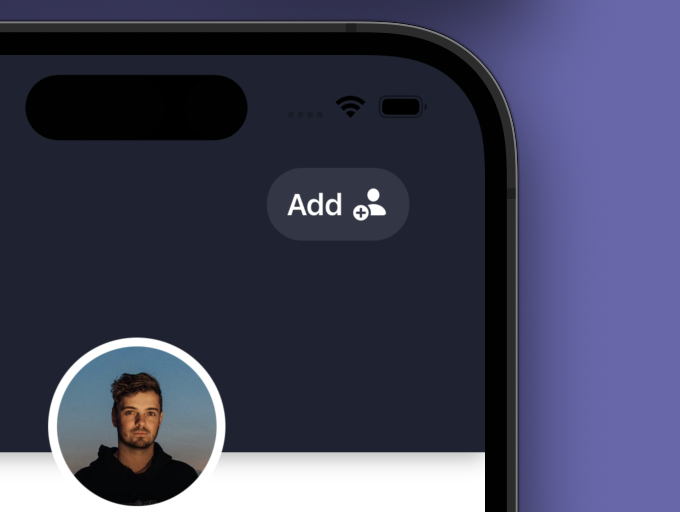

**4. View only the other user's favorite bets by clicking on the favorite bets section on the picker.**

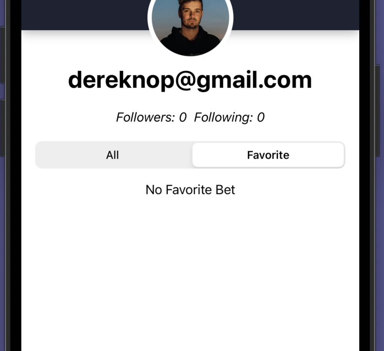

## Development Process
Throughout our development process, a lot of communication was involved in order to organize our workflow. Generally, we would text our progress whenever we completed tasks and we would Zoom in order to plan out our upcoming tasks as well as big-picture ideas throughout our time working on the project. The process worked quite well as we were able to let each know what and how tasks needed to be done in a pretty organized manner.

As for when and how tasks were completed, we typically would finish tasks whenever we had the time to do so. Usually, this would involve long periods of not working on the project followed by bursts of rapid progress. Overall, we split up the project into frontend and backend tasks which helped keep us organized. Also, we generally worked on different branches to keep Git errors and conflicts to a minimum.

Throughout our journey, we faced many setbacks that we needed to overcome. One of the setbacks included working with Git and XCode. At one point in our project, committing some of the XCode-specific files messed up our repository and caused previews to not build properly. Fixing this took a lot of time as many of the answers online didn't necessarily fix the problem, some creating even more problems. In the end, re-cloning the entire repository, restarting our computers, and sometimes manually finding files in the XCode project fixed the problem.

Another setback was merge conflicts. As with any project, working with multiple people will cause more merge conflicts, and at times, they can be quite difficult to resolve. Solving our merge conflicts would sometimes involve us getting on a Zoom call and working through each conflict together to see what needed to stay and what could be deleted. When we worked on large features of the app that involved the same files, the amount of merge conflicts definitely increased and it was quite challenging to decipher what to keep and what not to keep at times.

In terms of our original plan, setbacks did play a role in us changing the timeline for our plan. In addition to setbacks, not having enough time due to other classes and other responsibilities in our lives also played a role in delaying our original timeline. In the beginning, we tried to set the milestones to align with the nominal deadlines of the project. As we saw, however, we were unable to follow those timelines and we had to push back the deadline for each milestone instead. In the end, we ended up implementing all of our required minimum goals, and we also had time to implement our stretch goals as well.

Ultimately, we learned so much from this project. In terms of Swift, working hands-on on a full-scale project allowed us both to learn a lot about Swift. Many people feel that they learn more from work experience. The structure of this project made it feel like a work-like project which helped us both learn and grow our skills with the language. We have definitely become much more comfortable using Swift's syntax and features as we progressed with the project.

In terms of the development process, we both learned to be more generous with the deadlines we set in the beginning. Learning a new coding language is difficult and takes a lot of time, especially when using a new IDE as well. Although learning Swift was difficult at first, we both saw how fast we could pick up the language once we got the hang of it and we saw that our development speeds picked up as the class progressed as well.

As for other features, we worked with geotagging bets. Although we learned how to use CoreLocation, it only covered acquiring the latitude and longitude of a given location. For our project, we had to find a way to convert the latitude and longitude into a City and State. The process involved finding guides online which was not too difficult as there are so many resources online to look through. It was difficult in the beginning in that Swift has features for cities and states but they are called local and administrative areas respectively instead. Overall, it was not too difficult to integrate the feature into our app and it was nice to practice implementing features found online as it correlates to real-life work as well.

## Future Directions
In the future, we hope to fully polish our app. Not all of the user interfaces are completely to our liking so we hope to tweak those and make the user interfaces elegant, but also user-friendly as well. We also hope to incorporate numerous other features that we did not list in our stretch goals. Features such as having more social capabilities than what is present. Perhaps adding the ability to block users would be nice. We could also add a feature to automatically import the betting history from the more popular apps where users actually place their bets. 

Putting the app on the App Store could also be a route that we take in the future. If we do take this route, we would also probably need a way to make money as well since the App Store charges a fee for it. We could try figuring out ways to place ads in spots that won't annoy users too terribly, or maybe we could think of a way to monetize the app through memberships or ad-blocking fees.

In the future, we would hope that the app could be useful for many users. In the case where we are able to get a lot of users for the app, switching to a better database and optimizing our database queries will be useful to make load times shorter for users. Security is another problem we would need to worry about instead of holding user's emails with the account information in the database as plain text.

Ultimately, there are so many features and ideas we have for the app and it will definitely be fun to work on implementing those in the future. Maybe the app will become big and you will hear about us in the future. Or perhaps we will be lazy and never end up working on our startup idea. Who knows. Only the future can tell.
